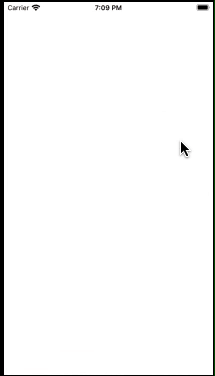

## Transactions list App

The app fetches and shows list of transactions/payments made by user. User can filter transactions by categories.

## Preview

### Development Environment

- Project is built on Xcode 13.2.1 , macOS 11.6.8

- Xcode project is tested and worked well on iPhone Simulator iOS 15.2, macOS 11.6.8
- 
- Project is built by using Swift and supports iOS 15.2 and above.

### Project Information

- App can be localised for different languages in future. At present localizations for English and German languages are added.

- App shows date, number and currency formatting based on user's region and language.

- Project fetches data from local MockData.json file. MockServerSession is used to mock the network communication. MockServerSession fails/succeeds randomly to simulate real network scenarios. 

- Project uses MVVM pattern, and SwiftUI for views. 

- Project uses Swift concurrency for multithreading.

- Project contains unit tests. Dependancy Injections are being used to mock network data for unit tests.

- Project uses Swift Package Manager for third party dependencies.

